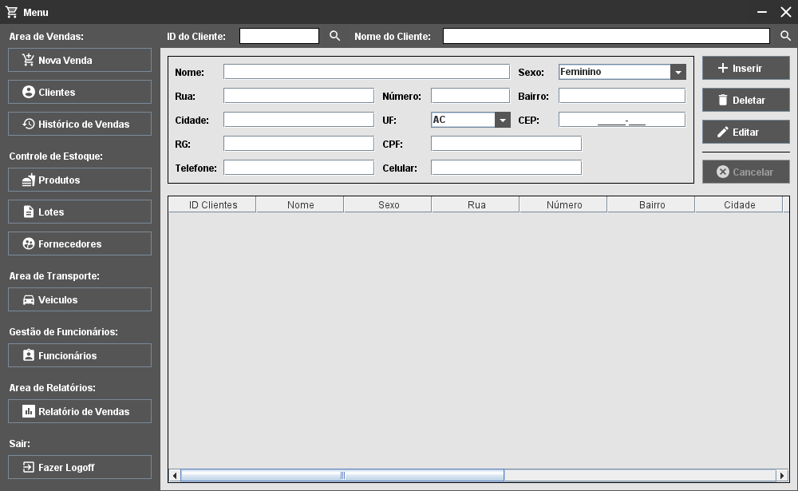

<h1 align="center">Projeto 2019: Sistema CRUD para um Mercado Delivery</h1>

**Status:** [*Descontinuado(???)*]

## Apresentação:

Projeto desenvolvido na primeira metade de 2019 durante o terceiro semestre do curso de ciências da computação com o objetivo de desenvolver uma interface para um aplicativo desktop utilizando **JAVA** (`Swing` e `AWT`) como linguagem de desenvolvimento.

## Sobre o Projeto:

A ideia para este projeto era ser um sistema CRUD para um supermercado que além de fornecer funções de controle de estoque e vendas teria como adicional as funcionalidades de controle de frota e entregas auxiliando assim vendas no modelo de negócios “delivery”.

## Requisitos:

- Runtime Java versão 8 (ou superior). 

## Como usar:

Para acessar o sistema utilize o seguinte Login e Senha:

- **Login:** `Admin`
- **Senha:** `Admin`

## Imagens:

### Tela de Login:

    
    <figcaption align="center">Tela de Login do Projeto</figcaption>

### Menu Principal:

    
    <figcaption align="center">Tela do Menu Principal do Projeto</figcaption>

## To-Do:

- [ ] Componentizar a interface do programa facilitando assim a sua manutenção.
- [ ] Finalizar o restante das interfaces e eliminar as desnecessárias.
- [ ] Refatorar o código eliminando repetições desnecessárias.
- [ ] Implementar um banco de dados para a aplicação.
- [ ] Reimplementar o sistema de temas.

## Links e Referencias

- [...]
